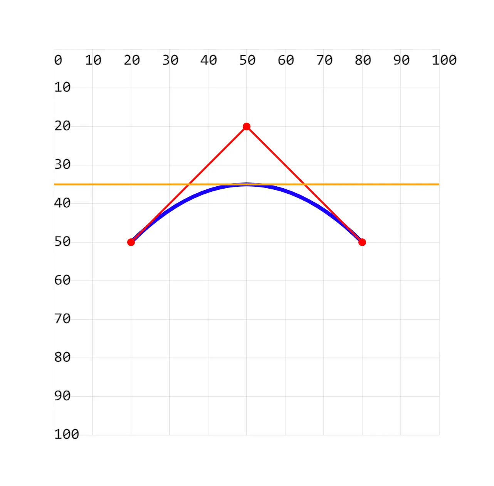
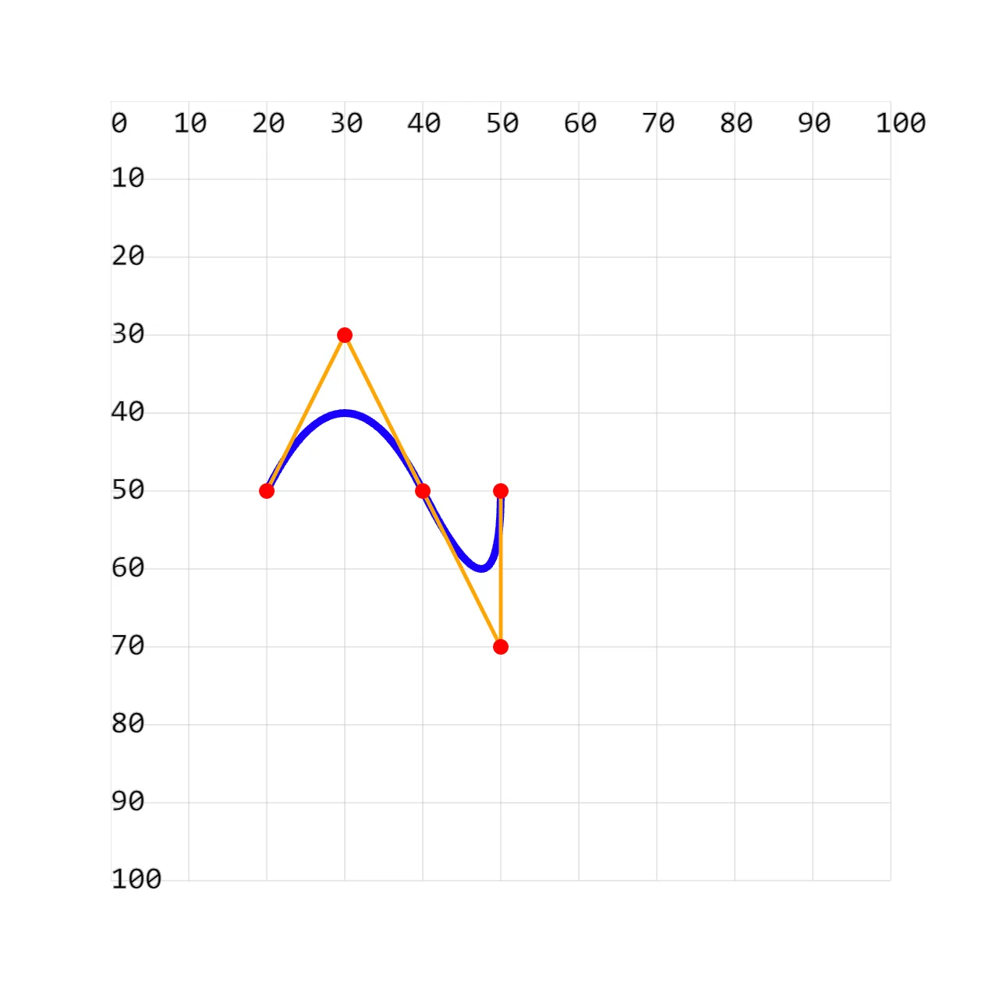

# [0010. 使用 path 绘制二次贝塞尔曲线](https://github.com/Tdahuyou/TNotes.svg/tree/main/notes/0010.%20%E4%BD%BF%E7%94%A8%20path%20%E7%BB%98%E5%88%B6%E4%BA%8C%E6%AC%A1%E8%B4%9D%E5%A1%9E%E5%B0%94%E6%9B%B2%E7%BA%BF)

<!-- region:toc -->
- [1. 💻 demos.1 - Q 绘制一个贝塞尔曲线](#1--demos1---q-绘制一个贝塞尔曲线)
- [2. 💻 demos.2 - Q、T 绘制连续的贝塞尔曲线](#2--demos2---qt-绘制连续的贝塞尔曲线)
- [3. 💻 demos.3 - Q、T 绘制连续的贝塞尔曲线](#3--demos3---qt-绘制连续的贝塞尔曲线)
<!-- endregion:toc -->
- 二次、三次贝塞尔曲线绘制原理，见 canvas.0025。

## 1. 💻 demos.1 - Q 绘制一个贝塞尔曲线

```xml
<!--
关键字 Q、T 的含义

  关键字 Q 对应单词：quadratic，表示“二次的”。

  Q: 表示 "Quadratic Bézier curve"（二次贝塞尔曲线）。
  这个命令后跟着两个点的坐标：控制点和终点。
  Q 30 30, 40 50 表示有一个控制点在 (30, 30) 和一个终点在 (40, 50)。

  T: 表示 "Smooth Quadratic Bézier curve to"（平滑的二次贝塞尔曲线到）。
  这个命令用于创建一个平滑的二次贝塞尔曲线，它假定前一个控制点已经存在，并基于前一个控制点自动计算当前控制点的位置，以确保曲线的平滑性。
  T 60 50 表示曲线平滑地继续到 (60, 50)。


示例 d="M 20 50 Q 50 20, 80 50"

  M 20 50
  表示从点 (20, 50) 开始

  Q 50 20, 80 50
  表示通过一个控制点 (50, 20) 绘制一个二次贝塞尔曲线
  最终结束于点 (80, 50)

  这条曲线将形成一个向上凸起的弧形，其中控制点定义了曲线的最高点和弯曲的程度。
-->
<svg style="margin: 1rem" width="110px" height="110px" xmlns="http://www.w3.org/2000/svg">
  <path d="M 20 50 Q 50 20, 80 50" fill="none" stroke="blue" stroke-width="1" />

  <!-- 辅助线 -->
  <line x1="50" y1="20" x2="20" y2="50" stroke="red" stroke-width=".5" />
  <line x1="50" y1="20" x2="80" y2="50" stroke="red" stroke-width=".5" />
  <line x1="0" y1="35" x2="100" y2="35" stroke="orange" stroke-width=".5" />

  <!-- 辅助点 -->
  <circle cx="50" cy="20" r="1" fill="red" />
  <circle cx="20" cy="50" r="1" fill="red" />
  <circle cx="80" cy="50" r="1" fill="red" />
</svg>
```



## 2. 💻 demos.2 - Q、T 绘制连续的贝塞尔曲线

```xml
<!--
d="M 20 50 Q 30 30, 40 50 T 60 50"

M 20 50 此命令将路径的起始点移动到坐标 (20, 50)

Q 30 30, 40 50 此命令创建一个二次贝塞尔曲线，起始点为 (20, 50)，控制点为 (30, 30)，结束点为 (40, 50)

T 60 50 此命令创建一个二次贝塞尔曲线，起始点为上一个结束点 (40, 50)，控制点为上一个控制点的对称点，结束点为 (60, 50)
-->
<svg style="margin: 1rem" width="110px" height="110px" xmlns="http://www.w3.org/2000/svg">
  <path d="M 20 50 Q 30 30, 40 50 T 60 50" fill="none" stroke="blue" stroke-width="1" />

  <!-- 辅助线 -->
  <line x1="30" y1="30" x2="20" y2="50" stroke="orange" stroke-width=".5" />
  <line x1="30" y1="30" x2="50" y2="70" stroke="orange" stroke-width=".5" />
  <line x1="60" y1="50" x2="50" y2="70" stroke="orange" stroke-width=".5" />

  <!-- 辅助点 -->
  <circle cx="30" cy="30" r="1" fill="red" />
  <circle cx="20" cy="50" r="1" fill="red" />
  <circle cx="40" cy="50" r="1" fill="red" />
  <circle cx="60" cy="50" r="1" fill="red" />
  <circle cx="50" cy="70" r="1" fill="red" />
</svg>
```


## 3. 💻 demos.3 - Q、T 绘制连续的贝塞尔曲线

```xml
<!--
d="M 20 50 Q 30 30, 40 50 T 50 50"

M 20 50 此命令将路径的起始点移动到坐标 (20, 50)

Q 30 30, 40 50 此命令创建一个二次贝塞尔曲线，起始点为 (20, 50)，控制点为 (30, 30)，结束点为 (40, 50)

T 50 50 此命令创建一个二次贝塞尔曲线，起始点为上一个结束点 (40, 50)，控制点为上一个控制点的对称点，结束点为 (50, 50)
-->
<svg style="margin: 1rem" width="110px" height="110px" xmlns="http://www.w3.org/2000/svg">
  <path d="M 20 50 Q 30 30, 40 50 T 50 50" fill="none" stroke="blue" stroke-width="1" />

  <!-- 辅助线 -->
  <line x1="20" y1="50" x2="30" y2="30" stroke="orange" stroke-width=".5" />
  <line x1="30" y1="30" x2="50" y2="70" stroke="orange" stroke-width=".5" />
  <line x1="50" y1="50" x2="50" y2="70" stroke="orange" stroke-width=".5" />

  <!-- 辅助点 -->
  <circle cx="30" cy="30" r="1" fill="red" />
  <circle cx="20" cy="50" r="1" fill="red" />
  <circle cx="40" cy="50" r="1" fill="red" />
  <circle cx="50" cy="50" r="1" fill="red" />
  <circle cx="50" cy="70" r="1" fill="red" />
</svg>
```


