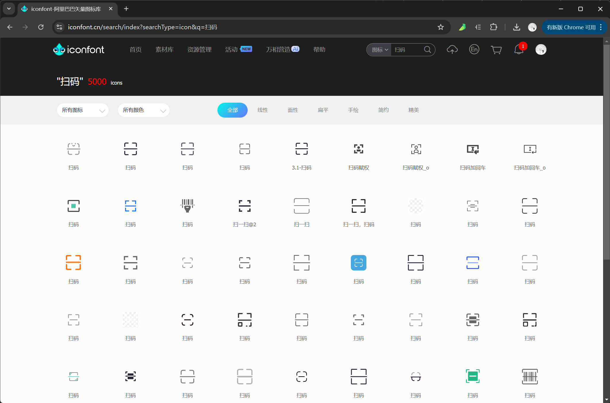
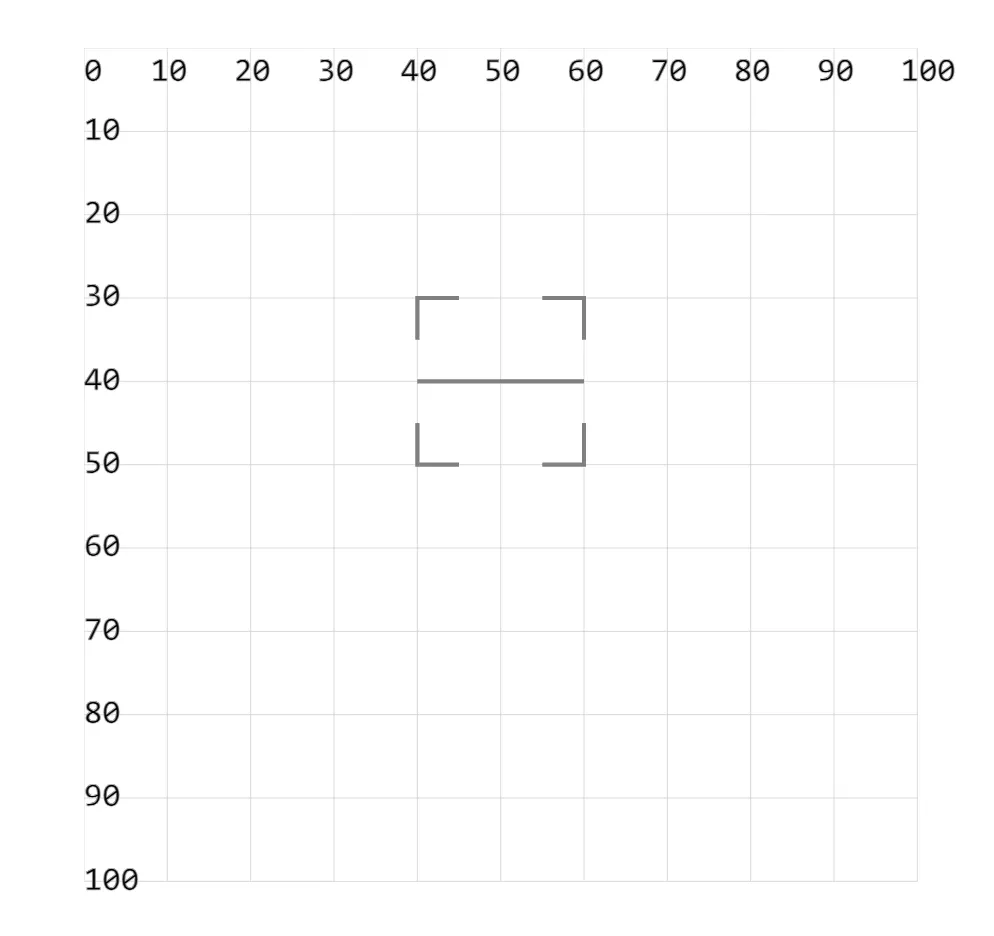

# [0013. 绘制【扫码】图标](https://github.com/Tdahuyou/TNotes.svg/tree/main/notes/0013.%20%E7%BB%98%E5%88%B6%E3%80%90%E6%89%AB%E7%A0%81%E3%80%91%E5%9B%BE%E6%A0%87)

<!-- region:toc -->
- [1. 🔗 iconfont 图标库](#1--iconfont-图标库)
- [2. 💻 demos.1 - 绘制扫码图标](#2--demos1---绘制扫码图标)
<!-- endregion:toc -->
- **svg 经常被用来设计一些图标，一些非常简单的可以直接手写，不过更多时候还是使用设计软件制作。**
- 在学习 svg 的过程中，可以自己找几个简单的图标来自行练习一下。
- 示例中绘制的扫码图标，使用的是 `<path>` 绘制直线的相关知识来实现的。
- 能够看懂代码就行。实现方式不唯一，做法有很多种，比如一条条地绘制 `<line>` 也行。

## 1. 🔗 iconfont 图标库

- https://www.iconfont.cn/
  - 这是阿里推出的 iconfont 图标库。
- iconfont 扫码图标
  - 在线搜【扫码】，仿照其中的扫码图标的效果，自己使用 `.svg` 来实现。
  - 

## 2. 💻 demos.1 - 绘制扫码图标

```xml
<svg style="margin: 3rem;" width="500px" height="500px" viewBox="0 0 120 120" xmlns="http://www.w3.org/2000/svg">
  <!-- 扫码 -->
  <!-- 示例中绘制的扫码图标，使用的是 <path> 绘制直线的相关知识来实现的。 -->
  <!-- 能够看懂代码就行。实现方式不唯一，做法有很多种，比如一条条地绘制 <line> 也行。 -->
  <path d="M 40 35 V 30 H 45 M 55 30 H 60 V 35 M 60 45 V 50 H 55 M 45 50 H 40 V 45 M 40 40 H 60" fill="none"
    stroke="gray" stroke-width=".5" />
</svg>
```


