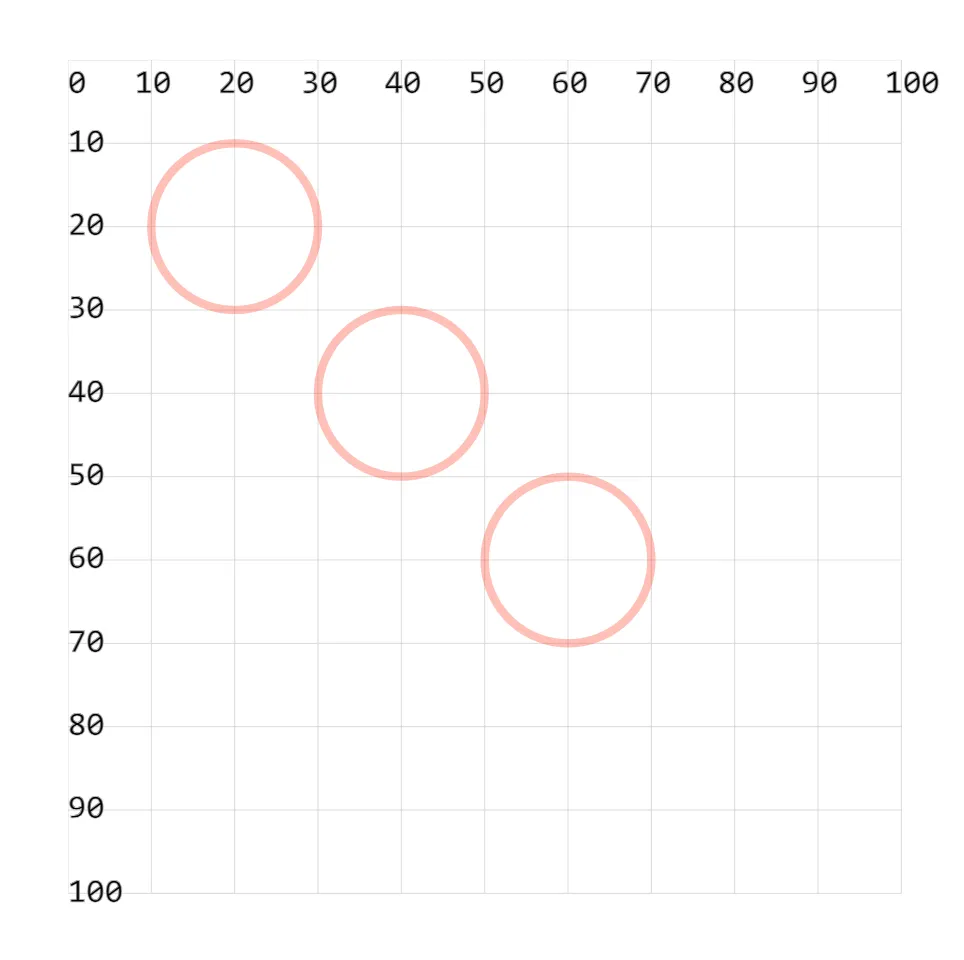

# [0020. 使用 use 引用图形](https://github.com/Tdahuyou/TNotes.svg/tree/main/notes/0020.%20%E4%BD%BF%E7%94%A8%20use%20%E5%BC%95%E7%94%A8%E5%9B%BE%E5%BD%A2)

<!-- region:toc -->
- [1. 💻 demos.1 - 使用 use 引用图形](#1--demos1---使用-use-引用图形)
<!-- endregion:toc -->
- `<use>` 元素允许您在不同位置多次重用或引用同一个定义过的图形对象，如符号、形状、组合图形等，可以减少一些重复代码的书写，提高效率和文件的整洁度。在实际开发中，这玩意儿的使用频率是算蛮高的，更多时候会结合 g、defs 元素一起使用。
- **注意事项**：use 中的 x 和 y 是基于引用图形的坐标，而不是坐标系。

## 1. 💻 demos.1 - 使用 use 引用图形

```xml
<svg style="margin: 3rem;" width="500px" height="500px" viewBox="0 0 120 120" xmlns="http://www.w3.org/2000/svg">
  <!--
  可以引用其他元素，在指定的位置绘制一个新图形（图形复用）。
  use 中的 x 和 y 是基于引用图形的坐标，而不是坐标系。
  -->
  <circle id="c1" cx="20" cy="20" r="10" stroke="red" fill="none" opacity=".3" />
  <use href="#c1" x="20" y="20" />
  <use href="#c1" x="40" y="40" />
  <!--
  use 复用 c1
  第一个 use 的圆心位置是 (40, 40)
  第一个 use 的圆心位置是 (60, 60)
   -->
</svg>
```


