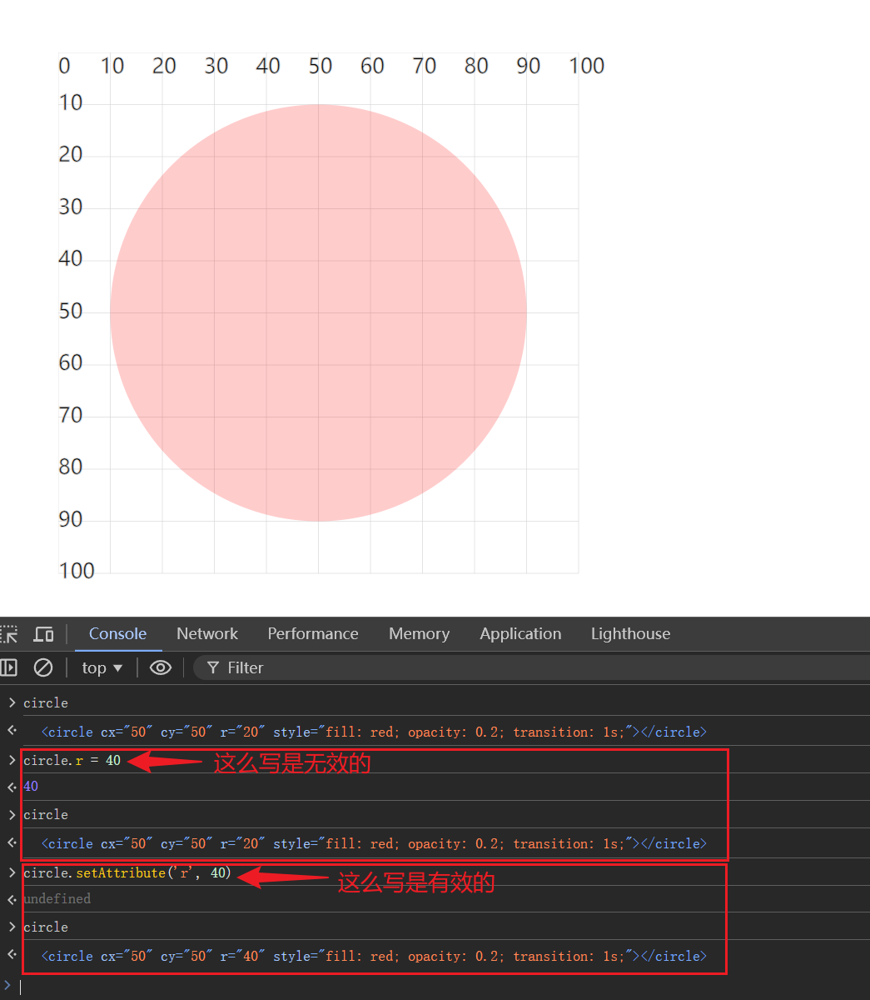
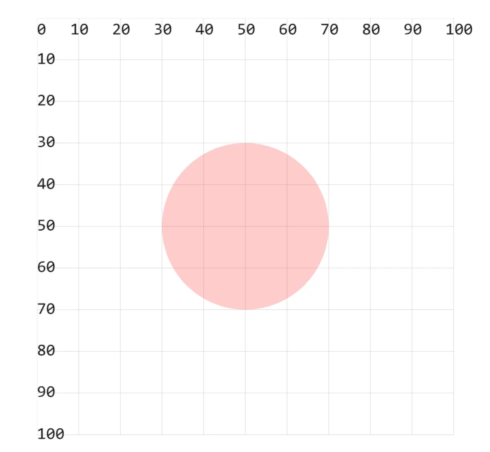
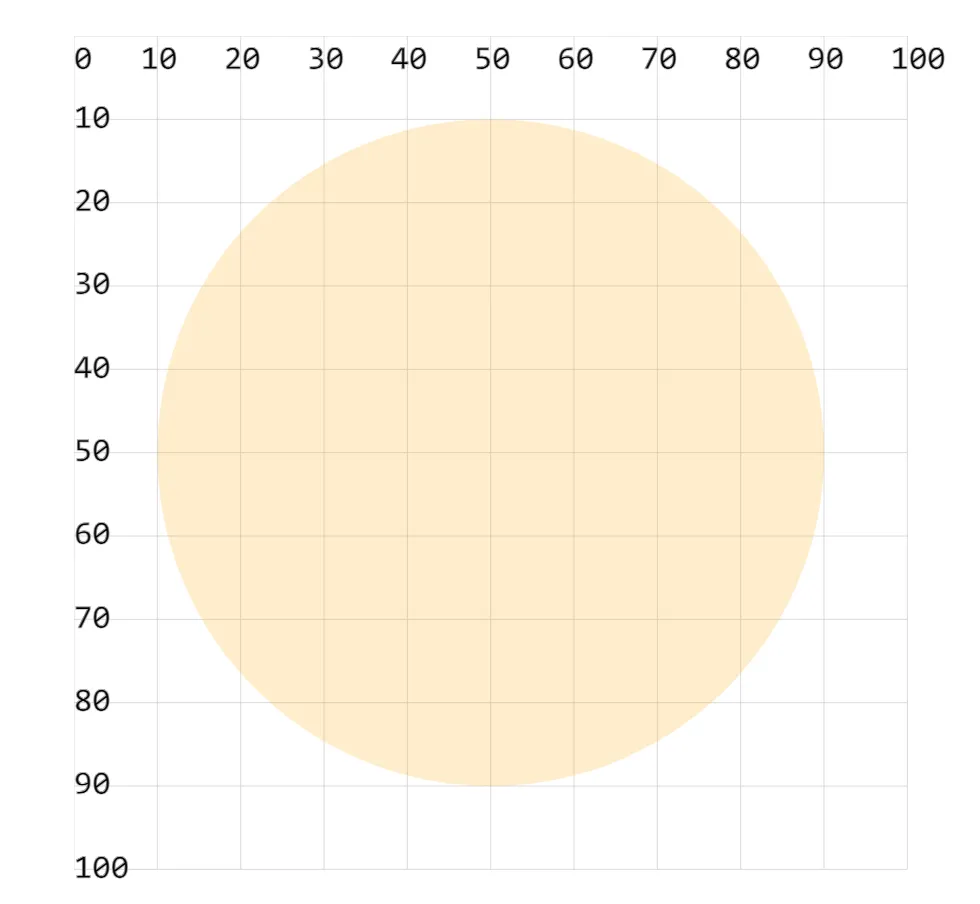
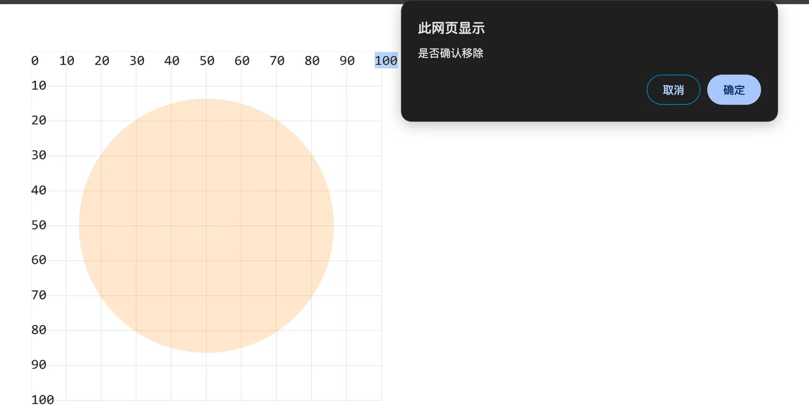

# [0022. 使用 js 控制 svg 实现 CRUD 操作](https://github.com/Tdahuyou/TNotes.svg/tree/main/notes/0022.%20%E4%BD%BF%E7%94%A8%20js%20%E6%8E%A7%E5%88%B6%20svg%20%E5%AE%9E%E7%8E%B0%20CRUD%20%E6%93%8D%E4%BD%9C)

<!-- region:toc -->

- [1. 🔗 snapsvg](#1--snapsvg)
- [2. 💻 demos.1 - 使用 js 控制 svg 实现 CRUD 操作](#2--demos1---使用-js-控制-svg-实现-crud-操作)
- [3. 🤔 问：CRUD 是什么？](#3--问crud-是什么)

<!-- endregion:toc -->
- 本节的都是一些非常简单的 js 逻辑，快速过一遍即可。
  - 注意点：在读写 svg 标签的属性值的时候（比如 circle 元素的圆心 cx、cy，半径 r），不能直接 `circle.r = xxx` 的方式操作属性，应该使用 `circle.setAttribute(r, xxx)` 和 `svg.getAttribute(r)` 方法操作属性。
- 实际在使用 js 来管理 svg 时，一般会使用一些现成的库，比如 [snapsvg](http://snapsvg.io/)。
- 如果不清楚 CRUD 是什么，可以见结尾的 Q&A。

## 1. 🔗 snapsvg

- http://snapsvg.io/
  - The JavaScript SVG library for the modern web

## 2. 💻 demos.1 - 使用 js 控制 svg 实现 CRUD 操作

```javascript
/**
 * 可以使用 js 的 dom 来操作 svg 标签，与之前的 dom 操作基本相同。
 * 
 * 【创建 svg 标签】
 * document.createElementNS(namespaceURI, qualifiedName)
 * namespaceURI 表示 svg 标签的命名空间，在 svg 标签中，这个值是固定的。比如：'http://www.w3.org/2000/svg'、'http://www.w3.org/1999/xhtml' 等。
 * qualifiedName 表示 svg 标签的名字，比如：circle、rect 等。
 * 
 * 创建 svg 标签的时候，需要指定命名空间，否则标签可以创建，属性可以设置，但浏览器却无法正常渲染它。有关命名空间的介绍，见笔记 svg.0046
 * 
 * 【查找 svg 标签】
 * 做法跟 dom 操作是一样的。
 * 比如：
 * const svg = document.getElementsByTagName('svg')[0]
 * document.getElementById()
 * document.getElementsByTagName()
 * document.getElementsByClassName()
 * document.getElementsByName()
 * document.querySelector()
 * document.querySelectorAll()
 * ...
 * 
 * 【读写 svg 标签的属性值】
 * 注意点：在读写 svg 标签的属性值的时候（比如 circle 元素的圆心 cx、cy，半径 r），不能直接 `circle.r = xxx` 的方式操作属性，应该使用 `circle.setAttribute(r, xxx)` 和 `svg.getAttribute(r)` 方法操作属性。
 * 
 * 正确做法：
 * circle.setAttribute('cx',50) // 写
 * circle.getAttribute('cx') // 读
 * 
 * 错误做法：
 * circle.cx = 50 // 无效
 * 
 * 【给 svg 标签绑定事件】
 * 做法跟 DOM 操作一致。
 * 比如：
 * svgElement.onclick = function(e) {}
 * svgElement.onmouseover = function(e) {}
 */

const circle = document.createElementNS('http://www.w3.org/2000/svg', 'circle')
const svg = document.getElementsByTagName('svg')[0]


svg.appendChild(circle) // 将 svg 标签添加到指定容器中

// 读写 svg 标签的属性值
circle.setAttribute('cx', 50)
circle.setAttribute('cy', 50)
circle.setAttribute('r', 20)
circle.style.fill = 'red'
circle.style.opacity = 0.2
circle.style.transition = 'all 1s'

console.log('圆的半径是：', circle.getAttribute('r')) // 圆的半径是： 20

// 给 svg 标签绑定事件
circle.onmouseover = () => {
  circle.setAttribute('r', 40)
  circle.style.fill = 'orange'
  circle.onmouseout = () => {
    circle.setAttribute('r', 20)
    circle.onmouseout = null
    circle.style.fill = 'red'
  }
}

// 读取 svg 标签的计算后样式
console.log('getComputedStyle(circle).fill =>', getComputedStyle(circle).fill)
// getComputedStyle(circle).fill => rgb(255, 0, 0)

// 删除 svg 标签
circle.ondblclick = function () {
  const b = confirm('是否确认移除')
  if (b) {
    svg.removeChild(circle)
  }
}
```

- 读写属性的注意事项：
  - 
- 最终效果：
  - 
  - 把鼠标想请到这个圆上，间隔 1 秒后会变成下面的样式。
  - 
  - 如果双击圆形，那么会弹出一个 confirm 提示框，点击确定后，圆将被删除。
  - 

## 3. 🤔 问：CRUD 是什么？

CRUD 是一个计算机编程中常用的术语，代表了数据库或数据存储的四个基本操作：**创建（Create）、读取（Read）、更新（Update）和删除（Delete）**。这个概念特别适用于数据库管理和编程中的数据处理，是很多软件开发项目中数据操作的基础。

- **创建（Create）**：指向数据库添加新的记录。例如，在一个用户数据库中添加一个新用户。
- **读取（Read）**：查询并检索数据库中的数据。这可以通过直接查看单个条目或执行搜索查询来实现，以获取满足特定条件的一组数据。
- **更新（Update）**：修改数据库中已存在的数据。比如，更新用户的信息，如他们的邮箱地址或密码。
- **删除（Delete）**：从数据库中永久移除数据。例如，如果一个用户决定删除他们的账户，相关的用户记录将从数据库中删除。

这四种操作是大多数应用程序与数据交互的基础，无论是在 Web 应用、移动应用还是桌面程序中。正确实现 CRUD 操作对于保证数据的完整性和一致性至关重要。
