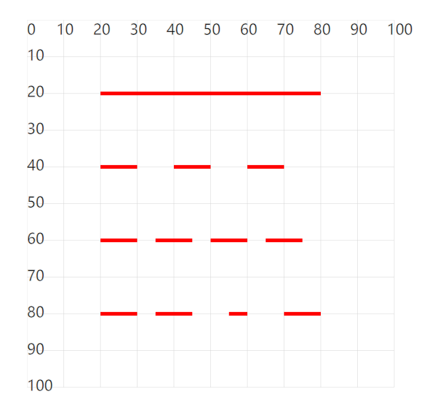

# [0025. 使用属性 stroke-dasharray 设置虚线](https://github.com/Tdahuyou/TNotes.svg/tree/main/notes/0025.%20%E4%BD%BF%E7%94%A8%E5%B1%9E%E6%80%A7%20stroke-dasharray%20%E8%AE%BE%E7%BD%AE%E8%99%9A%E7%BA%BF)

<!-- region:toc -->
- [1. 💻 demos.1 - 使用属性 stroke-dasharray 设置虚线](#1--demos1---使用属性-stroke-dasharray-设置虚线)
<!-- endregion:toc -->
- path 中的 stroke-dasharray 属性可以用虚线设置描边。
- 属性值设置的是虚线区域的长度和空白区域的长度。

## 1. 💻 demos.1 - 使用属性 stroke-dasharray 设置虚线

```xml
<svg style="margin: 3rem;" width="500px" height="500px" viewBox="0 0 120 120" xmlns="http://www.w3.org/2000/svg">
  <!--
  stroke-dasharray：使用虚线设置描边，并设置虚线及空白的长度。

  stroke-dasharray="10"
  每一段线长度为 10，两段线之间的空白为 10

  stroke-dasharray="10 5"
  每一段线长度为 10，两段线之间的空白为 5

  stroke-dasharray="10 5 10"
  设置时后面的长度会复制前面的数值 10 5 10 10 5 10 10 5 10
  长度为 10 的虚线、长度为 5 的空白、长度为 10 的虚线、长度为 10 的空白、长度为 5 的虚线、长度为 10 的空白、……
  -->
  <path d="M20 20H80" fill="none" stroke="red" stroke-width="1" />
  <path d="M20 40H80" fill="none" stroke="red" stroke-width="1"
    stroke-dasharray="10" /> <!-- [!code highlight] -->
  <path d="M20 60H80" fill="none" stroke="red" stroke-width="1"
    stroke-dasharray="10 5" /> <!-- [!code highlight] -->
  <path d="M20 80H80" fill="none" stroke="red" stroke-width="1"
    stroke-dasharray="10 5 10" /> <!-- [!code highlight] -->
</svg>
```

- 
