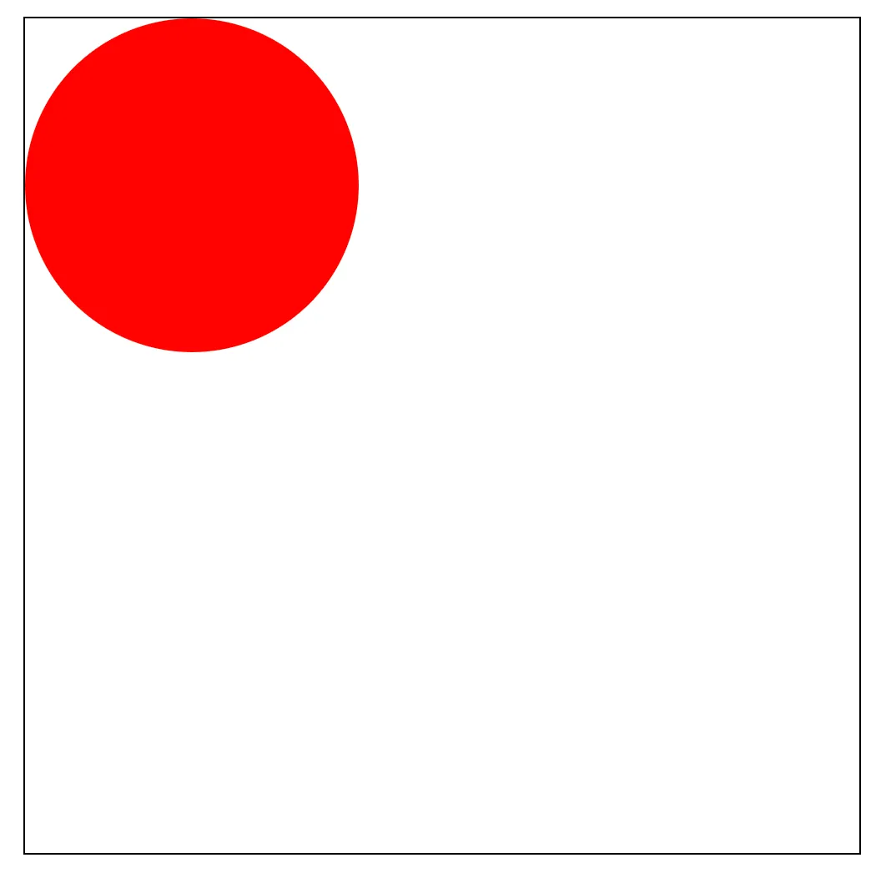
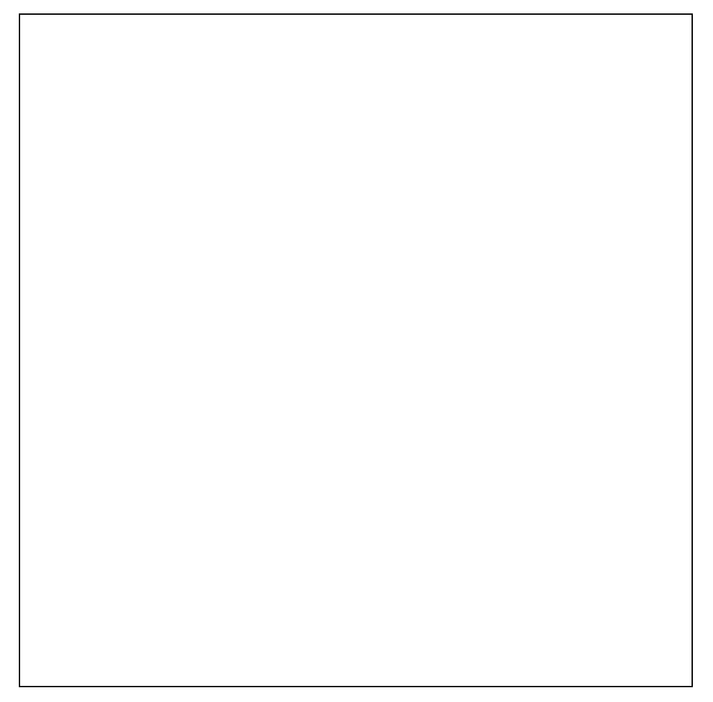
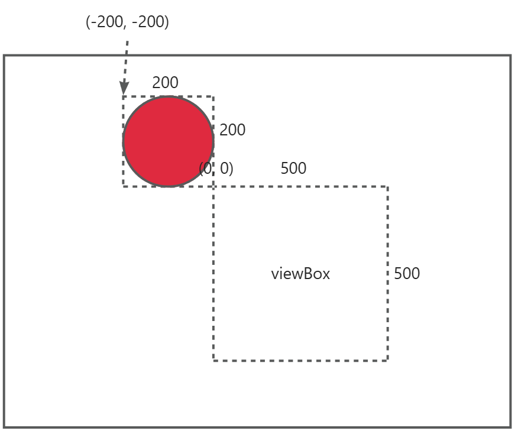

# [0034. 理解 viewBox 视口](https://github.com/Tdahuyou/TNotes.svg/tree/main/notes/0034.%20%E7%90%86%E8%A7%A3%20viewBox%20%E8%A7%86%E5%8F%A3)

<!-- region:toc -->

- [1. 💻 demos.1 - 省略 `viewBox`](#1--demos1---省略-viewbox)
- [2. 💻 demos.2 - 指定 viewBox 正好装下图形](#2--demos2---指定-viewbox-正好装下图形)
- [3. 💻 demos.3 - 指定的 viewBox 区域看不到图形](#3--demos3---指定的-viewbox-区域看不到图形)
- [4. 💻 demos.4 - 根据 demos.3 中的图形位置修改 viewBox 的值](#4--demos4---根据-demos3-中的图形位置修改-viewbox-的值)
- [5. 🤔 问：svg 中坐标系有多大？](#5--问svg-中坐标系有多大)
- [6. 🤔 问：`<svg>` 的 width、height 有什么用？](#6--问svg-的-widthheight-有什么用)
- [7. 🤔 问：`<svg>` 的 width、height 都设置为 500，那么看到的坐标系是哪块区域呢？](#7--问svg-的-widthheight-都设置为-500那么看到的坐标系是哪块区域呢)

<!-- endregion:toc -->
- viewBox 视口，这是一个对于 svg 初学者来说不那么好理解的属性。
- 其实 viewBox 这个词已经描述得很到位了，view 看，box 盒子，其中盒子可以理解为一个矩形区域 —— viewBox 表示你要看哪一块矩形区域。
- 可以结合着 `Q&A` 中提到的问题来理解 viewBox 属性。

## 1. 💻 demos.1 - 省略 `viewBox`

```xml
<!--
svg 的坐标系是隐式的，是无限大的。
svg 的 width、height 属性，决定了页面上最终渲染的 svg 的宽度和高度。
viewbox 属性，决定了展示给用户的 svg 坐标系区域。
  viewbox 的值是一个矩形，由 4 个值组成，分别是 x、y、width、height。
  x、y 是坐标系的起点，width、height 是坐标系的宽高。
如果只设置了 svg 的 width 和 height，但没有设置 viewbox，则 viewbox 默认为 0 0 width height。

如果 viewBox 的 width、height 和 svg 的 width、height 不一致，则用户看到的图形将会进行缩放。
-->

<!--
在没有设置 viewBox 的情况下，显示的视口区域是 0 0 width height
图形比例按照 1:1 来显示
-->
<svg width="500" height="500" xmlns="http://www.w3.org/2000/svg" style="border: 1px solid">
  <circle cx="100" cy="100" r="100" fill="red" />
</svg>
```



## 2. 💻 demos.2 - 指定 viewBox 正好装下图形


```xml
<!--
在明确 viewBox 的情况下，显示的视口区域是 0 0 200 200
相当于只展示圆形区域
这会将绘制的圆形放大显示
-->
<svg width="500" height="500" viewBox="0 0 200 200" xmlns="http://www.w3.org/2000/svg" style="border: 1px solid">
  <circle cx="100" cy="100" r="100" fill="red" />
</svg>
```

- 

## 3. 💻 demos.3 - 指定的 viewBox 区域看不到图形


```xml
<!--
在没有设置 viewBox 的情况下，显示的视口区域是 0 0 width height。
下面的图形并没有在界面上显示出来。
这并不是说图形在坐标系上不存在，而是在可视的坐标系（viewBox）之外，所以我们看不到。
坐标系是无限大的，下面绘制的圆形在 viewBox 坐标系（0 0 width height）外部，不会显示。
-->
<svg width="500" height="500" xmlns="http://www.w3.org/2000/svg" style="border: 1px solid">
  <circle cx="-100" cy="-100" r="100" fill="red" />
</svg>
```

- 
- 

这个示例类似上图，我们在画布上绘制了红色的圆形，可惜它不在 `viewBox` 中，所以我们看不到它。

## 4. 💻 demos.4 - 根据 demos.3 中的图形位置修改 viewBox 的值


```xml
<!--
想要解决上述圆形看不到的问题，可以通过设置 viewBox 来解决。
我们只需要将 viewBox 设置为包含圆形的矩形即可。
viewBox 决定了我们想要展示给用户看的那块坐标区域。
-->
<svg width="500" height="500" viewBox="-200 -200 200 200" xmlns="http://www.w3.org/2000/svg" style="border: 1px solid">
  <circle cx="-100" cy="-100" r="100" fill="red" />
</svg>
```

- 

## 5. 🤔 问：svg 中坐标系有多大？

答：无限大～

## 6. 🤔 问：`<svg>` 的 width、height 有什么用？

svg 的 width、height 属性，决定了页面上最终渲染的 svg 的宽度和高度。

也就是我们看到的画布的大小。

## 7. 🤔 问：`<svg>` 的 width、height 都设置为 500，那么看到的坐标系是哪块区域呢？

答：不要问这个问题，该问题的提问本身就存在问题。

记住一点：**看到的坐标系区域跟 `<svg>` 的 width、height 没有任何关系，具体得看 `viewBox` 设置的是什么值，`viewBox` 属性才决定了我们想要展示给用户看的那块坐标区域。**

- 在没有写 `viewBox` 的情况下（或者 `viewBox="0 0 500 500"`），看到的坐标系区域是 `(0, 0) 到 (500, 500)`，我们所绘制的图形将按照 `1:1` 的效果来显示。也就是绘制的是多大，看到的就是多大。
  - 
  - 坐标系是无限大的，`viewBox` 决定了我们要看哪一部分坐标区域。
- 如果 `viewBox` 设置的区域和 svg 的 width、height 尺寸不一致，那么会将 `viewBox` 指定的区域进行自动缩放，以适应 width、height 尺寸。
  - **假如 `viewBox="0 0 1000 1000"`，那么看到的图形将被缩小到原来的 1/2。**
    - 道理很简单，1000 个点，被放到 500 的区域中显示，自然每个点都要缩小到原来的 1/2。
  - **假如 `viewBox="0 0 100 100"`，那么看到的图形将会放大到原来的 5 倍。**
    - 100 个点，被放到 500 的区域中显示，每个点会被拉伸到原来的 5 倍大小，这时候看到的图也是不完整的。
- **上面讨论的场景，刻意规避掉了一种情况：宽高比不同**
  - 会发现上述举的示例，都满足一个条件：`viewBox 的宽高比 width/height 等于 svg 的宽高比 width/height`。
  - 至于俩不相等的情况，需要设计到另外一个属性 —— `preserveAspectRatio`。
  - 有关 `preserveAspectRatio` 的内容，会在后续介绍到，到时候再来看，对于 `width/height` 不一致的情况下，页面会如何渲染。
