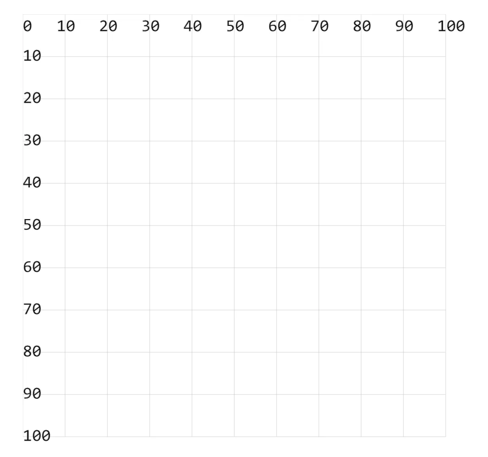
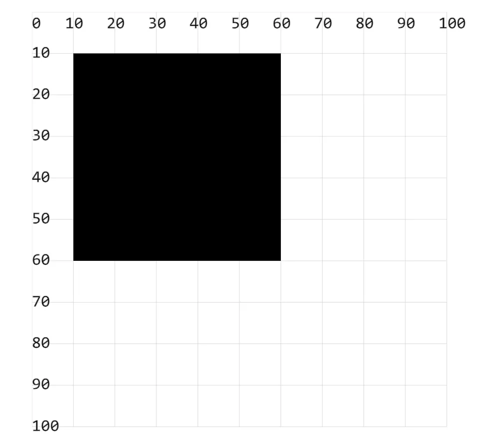

# [0035. 绘制坐标系网格](https://github.com/Tdahuyou/TNotes.svg/tree/main/notes/0035.%20%E7%BB%98%E5%88%B6%E5%9D%90%E6%A0%87%E7%B3%BB%E7%BD%91%E6%A0%BC)

<!-- region:toc -->

- [1. 💻 demos.1 - 绘制坐标系网格](#1--demos1---绘制坐标系网格)

<!-- endregion:toc -->
- 这里绘制的网格，是为了又一个更直观的参考坐标系，学习 svg、canvas 之类的内容，很多时候都是在手写一个个坐标，有一个直观的坐标参考系，写起来会方便很多。
- 想要理解这个坐标是怎么绘制的，涉及到以下知识点：`<line>`、`<text>`、`<g>`、`viewBox`。
- `<line>`、`<text>`、`<g>`这些内容都很简单，后续对它们都有介绍。即便还没有学习到这些元素，直接结合着注释看源代码，你应该也差不多能够理解文档中的网格是如何绘制出来的了。
- 至于 `viewBox`，它表示视口，不是一两句话讲得清楚的，这玩意儿后续也会单独介绍。

## 1. 💻 demos.1 - 绘制坐标系网格

- 绘制一个网格，标注上刻度，以便在学习的时候能够更加直观地看到对应的坐标刻度。
  - 
  - 上述网格的绘制原理也非常简单，主要就是画线 `<line>` ➕  标注刻度 `<text>`。

```xml
<svg style="margin: 3rem;" width="500px" height="500px" viewBox="0 0 120 120" xmlns="http://www.w3.org/2000/svg">
  <!--
  【网格区域】
  网格区域的绘制原理其实很简单，就是在一个矩形区域内绘制横向和纵向的线条，然后通过 text 加上刻度标注。
  相关知识点在后续的内容中都会介绍的， 初学阶段直接拿来用就行了。
  绘制这个网格的目的是为了在介绍或许知识点时有一个参考系坐标，这样看起来会更加直观。
  -->
  <g font-size="4" stroke="lightgray" stroke-width=".1">
    <!-- 纵向网格线 -->
    <line x1="0" y1="0" x2="0" y2="100" />
    <line x1="10" y1="0" x2="10" y2="100" />
    <line x1="20" y1="0" x2="20" y2="100" />
    <line x1="30" y1="0" x2="30" y2="100" />
    <line x1="40" y1="0" x2="40" y2="100" />
    <line x1="50" y1="0" x2="50" y2="100" />
    <line x1="60" y1="0" x2="60" y2="100" />
    <line x1="70" y1="0" x2="70" y2="100" />
    <line x1="80" y1="0" x2="80" y2="100" />
    <line x1="90" y1="0" x2="90" y2="100" />
    <line x1="100" y1="0" x2="100" y2="100" />

    <!-- 横向网格线 -->
    <line x1="0" y1="0" x2="100" y2="0" />
    <line x1="0" y1="10" x2="100" y2="10" />
    <line x1="0" y1="20" x2="100" y2="20" />
    <line x1="0" y1="30" x2="100" y2="30" />
    <line x1="0" y1="40" x2="100" y2="40" />
    <line x1="0" y1="50" x2="100" y2="50" />
    <line x1="0" y1="60" x2="100" y2="60" />
    <line x1="0" y1="70" x2="100" y2="70" />
    <line x1="0" y1="80" x2="100" y2="80" />
    <line x1="0" y1="90" x2="100" y2="90" />
    <line x1="0" y1="100" x2="100" y2="100" />

    <!-- 纵向刻度值 -->
    <text x="0" y="4" fill="black">0</text>
    <text x="0" y="11" fill="black">10</text>
    <text x="0" y="21" fill="black">20</text>
    <text x="0" y="31" fill="black">30</text>
    <text x="0" y="41" fill="black">40</text>
    <text x="0" y="51" fill="black">50</text>
    <text x="0" y="61" fill="black">60</text>
    <text x="0" y="71" fill="black">70</text>
    <text x="0" y="81" fill="black">80</text>
    <text x="0" y="91" fill="black">90</text>
    <text x="0" y="101" fill="black">100</text>

    <!-- 横向刻度线 -->
    <text x="8" y="4" fill="black">10</text>
    <text x="18" y="4" fill="black">20</text>
    <text x="28" y="4" fill="black">30</text>
    <text x="38" y="4" fill="black">40</text>
    <text x="48" y="4" fill="black">50</text>
    <text x="58" y="4" fill="black">60</text>
    <text x="68" y="4" fill="black">70</text>
    <text x="78" y="4" fill="black">80</text>
    <text x="88" y="4" fill="black">90</text>
    <text x="98" y="4" fill="black">100</text>
  </g>
  <!--
  【如何使用？】
  在学习时，直接把网格的源码搬运过去，然后把上面的网格直接折叠起来即可。
  后续绘制的图形可以直接写在下面就行。
  比如：
  -->
  <rect x="10" y="10" width="50" height="50"/> <!-- [!code highlight] -->
</svg>
```

- 
